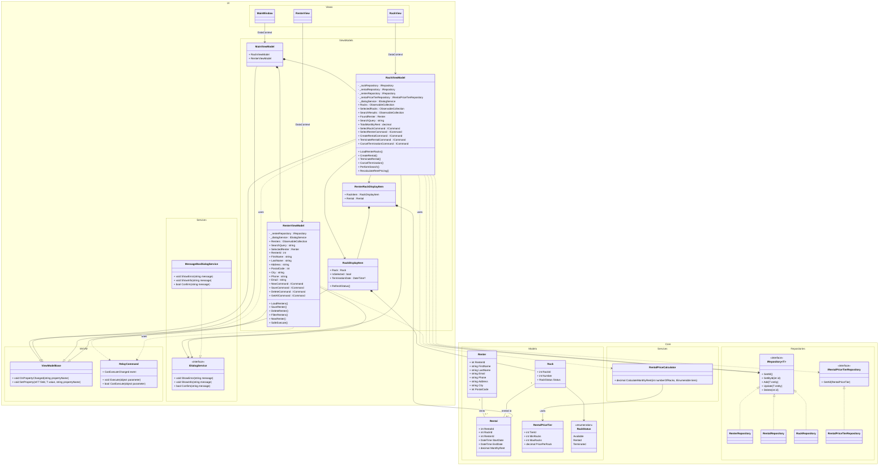

```mermaid
classDiagram

%%======================
%% MODELS
%%======================
namespace Core.Models{
class Renter{
+ int RenterId
+ string FirstName
+ string LastName
+ string Email
+ string Phone
+ string Address
+ string City
+ int PostalCode
}

class Rental{
+ int RentalId
+ int RackId
+ int RenterId
+ DateTime StartDate
+ DateTime EndDate
+ decimal MonthlyRent
}

class Rack{
+ int RackId
+ int Number
+ RackStatus Status
}

class RentalPriceTier{
+ int TierId
+ int MinRacks
+ int MaxRacks
+ decimal PricePerRack
}

class RackStatus{
<<enumeration>>
	Available
	Rented
	Terminated
}
}

%%======================
%% REPOSITORIES
%%======================
namespace Core.Repositories{

class IRepository~T~{
<<interface>>
+ GetAll()
+ GetById(int id)
+ Add(T entity)
+ Update(T entity)
+ Delete(int id)
}

class IRentalPriceTierRepository{
<<interface>>
+ GetAll(RentalPriceTier)
}

class RenterRepository
class RentalRepository
class RackRepository
class RentalPriceTierRepository

}


%%======================
%% Services
%%======================
namespace Core.Services{
class RentalPriceCalculator{
+ decimal CalculateMonthlyRent(int numberOfRacks, IEnumerable<RentalPriceTier> tiers)
}
}

%%======================
%% MVVM
%%======================
namespace UI.MVVM{

class ViewModelBase{
+ void OnPropertyChanged(string propertyName)
+ void SetProperty<T>(ref T field, T value, string propertyName)
}

class RelayCommand{
+ void Execute(object parameter)
+ bool CanExecute(object parameter)
+ CanExecuteChanged event
}
}

%%======================
%% SERVICES
%%======================
namespace UI.Services{
class IDialogService{
<<interface>>
+ void ShowError(string message)
+ void ShowInfo(string message)
+ bool Confirm(string message)
}

class MessageBoxDialogService{
+ void ShowError(string message)
+ void ShowInfo(string message)
+ bool Confirm(string message)
}
}

%%======================
VIEWMODELS
%%======================
namespace UI.ViewModels{
class MainViewModel{
+ RackViewModel
+ RenterViewModel
}

class RackViewModel{
- _rackRepository : IRepository<Rack>
- _rentalRepository : IRepository<Rental>
- _renterRepository : IRepository<Renter>
- _rentalPriceTierRepository : IRentalPriceTierRepository
- _dialogService : IDialogService
+ Racks : ObservableCollection<RackDisplayItem>
+ SelectedRacks : ObservableCollection<RackDisplayItem>
+ SearchResults : ObservableCollection<Renter>
+ FoundRenter : Renter
+ SearchQuery : string
+ TotalMonthlyRent : decimal
+ SelectRackCommand : ICommand
+ SelectRenterCommand : ICommand
+ CreateRentalCommand : ICommand
+ TerminateRentalCommand : ICommand
+ CancelTerminationCommand : ICommand

+ LoadRenterRacks()
+ CreateRental()
+ TerminateRental()
+ CancelTermination()
+ PerformSearch()
+ RecalculateRentPricing()
}

class RenterViewModel{
- _renterRepository : IRepository<Renter>
- _dialogService : IDialogService
+ Renters : ObservableCollection<Renter>
+ SearchQuery : string
+ SelectedRenter : Renter
+ RenterId : int
+ FirstName : string
+ LastName : string
+ Address : string
+ PostalCode : int
+ City : string
+ Phone : string
+ Email : string
+ NewCommand : ICommand
+ SaveCommand : ICommand
+ DeleteCommand : ICommand
+ GetAllCommand : ICommand
+ LoadRenters()
+ SaveRenter()
+ DeleteRenter()
+ FilterRenters()
+ NewRenter()
+ SafeExecute()
}

class RackDisplayItem{
+ Rack : Rack
+ IsSelected : bool
+ TerminationDate : DateTime?
+ RefreshStatus()
}

class RenterRackDisplayItem{
+ RackItem : RackDisplayItem
+ Rental : Rental
}

}


%%======================
%% VIEWS
%%======================
namespace UI.Views{
class MainWindow
class RackView
class RenterView
}

%%======================
%% RELATIONSHIPS
%%======================

Renter "1" -- "0..*" Rental : rents
Rack "1" -- "0..*" Rental : rented in
Rack --> RackStatus : 
RentalPriceCalculator --> RentalPriceTier : uses
RackDisplayItem *-- Rack
RackViewModel --> RackDisplayItem
RackViewModel --> RenterRackDisplayItem
RenterRackDisplayItem *-- RackDisplayItem
RenterRackDisplayItem *-- Rental
RackViewModel ..> RentalPriceCalculator : uses

%%=====================
%%REPOSITORY IMPLEMENTATIONS
%%=====================
IRepository~T~ <|.. RenterRepository
IRepository~T~ <|.. RentalRepository
IRepository~T~ <|.. RackRepository
IRentalPriceTierRepository <|.. RentalPriceTierRepository


%%=====================
%%MVVM INHERITANCE
%%=====================
RackViewModel --|> ViewModelBase
RenterViewModel --|> ViewModelBase
MainViewModel --|> ViewModelBase
RackDisplayItem --|> ViewModelBase


%%=====================
%% COMMANDS
%%=====================
RackViewModel ..> RelayCommand : uses
RenterViewModel ..> RelayCommand : uses

%%=====================
%% REPOSITORY USAGE
%%=====================
RenterViewModel ..> IRepository~Renter~
RackViewModel ..> IRepository~Rack~
RackViewModel ..> IRepository~Rental~
RackViewModel ..> IRepository~Renter~
RackViewModel ..> IRentalPriceTierRepository

%%=====================
%% DIALOG SERVICE USAGE
%%=====================
RackViewModel --> IDialogService
RenterViewModel --> IDialogService
MessageBoxDialogService ..|> IDialogService

%%=====================
%% MAIN VIEWMODEL USAGE
%%=====================
MainViewModel *-- RackViewModel
MainViewModel *-- RenterViewModel

%%=====================
DATACONTEXT
%%=====================
MainWindow --> MainViewModel : DataContext
RackView --> RackViewModel : DataContext
RenterView --> RenterViewModel : DataContext

```